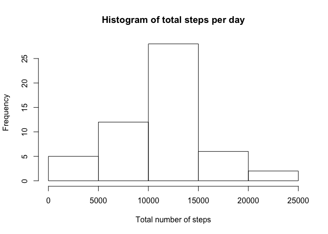

# Reproducible Research: Peer Assessment 1


## Loading and preprocessing the data
Here we load the data into dataframe df

```r
df<-read.csv("activity.csv")
df$date<-as.Date(df$date,format='%Y-%m-%d')
summary(df)
```

```
##      steps             date               interval     
##  Min.   :  0.00   Min.   :2012-10-01   Min.   :   0.0  
##  1st Qu.:  0.00   1st Qu.:2012-10-16   1st Qu.: 588.8  
##  Median :  0.00   Median :2012-10-31   Median :1177.5  
##  Mean   : 37.38   Mean   :2012-10-31   Mean   :1177.5  
##  3rd Qu.: 12.00   3rd Qu.:2012-11-15   3rd Qu.:1766.2  
##  Max.   :806.00   Max.   :2012-11-30   Max.   :2355.0  
##  NA's   :2304
```


## What is mean total number of steps taken per day?
We load the dplyr package. There are some informational messages.

```r
library(dplyr)
```

```
## 
## Attaching package: 'dplyr'
```

```
## The following objects are masked from 'package:stats':
## 
##     filter, lag
```

```
## The following objects are masked from 'package:base':
## 
##     intersect, setdiff, setequal, union
```
Using the pipeline operator %>% and the group_by function of dplyr package, we split the data into different dates and find total number of steps taken each day, plotting a histogram of the steps taken per day. Here we first get rid of NA values in steps.

```r
df1<-df[(!(is.na(df$steps))),]
df2 <- (df1 %>% group_by(date) %>% summarize(tot_steps=sum(steps,na.rm=TRUE)))
hist(df2$tot_steps,main="Histogram of total steps per day",xlab="Total number of steps",breaks=6)
```

<!-- -->

Calculaing mean and median of total steps each day

```r
print(mean(df2$tot_steps))
```

```
## [1] 10766.19
```

```r
print(median(df2$tot_steps))
```

```
## [1] 10765
```

## What is the average daily activity pattern?
Calculating the number of steps taken in an interval, averaged over all the days

```r
df3 <- (df1 %>% group_by(interval) %>% summarize(avg_steps=mean(steps)))
plot(df3$interval,df3$avg_steps,type="l",xlab="interval",ylab="Avg. steps")
```

<!-- -->

The interval with maximum number of time steps on average is

```r
df3$interval[which.max(df3$avg_steps)]
```

```
## [1] 835
```

## Imputing missing values
We replace missing values by the average steps taken in that interval on those days where the values are available. We have already created the df3 data frame above that shows the average steps taken during an interval. We use values from df3 to fill in the missing values.

```r
for(i in 1:nrow(df)) {
  if (is.na(df$steps[i])) {
    intrv<-df$interval[i]
    df$steps[i]<-df3$avg_steps[df3$interval==intrv]
  }
}
summary(df)
```

```
##      steps             date               interval     
##  Min.   :  0.00   Min.   :2012-10-01   Min.   :   0.0  
##  1st Qu.:  0.00   1st Qu.:2012-10-16   1st Qu.: 588.8  
##  Median :  0.00   Median :2012-10-31   Median :1177.5  
##  Mean   : 37.38   Mean   :2012-10-31   Mean   :1177.5  
##  3rd Qu.: 27.00   3rd Qu.:2012-11-15   3rd Qu.:1766.2  
##  Max.   :806.00   Max.   :2012-11-30   Max.   :2355.0
```
Next making the histogram of the total steps taken everyday, and their mean and median values, now with this new data frame

```r
df4 <- (df %>% group_by(date) %>% summarize(tot_steps=sum(steps,na.rm=TRUE)))
hist(df4$tot_steps,main="Histogram of total steps per day",xlab="Total number of steps",breaks=6)
```

<!-- -->

```r
print(mean(df4$tot_steps))
```

```
## [1] 10766.19
```

```r
print(median(df4$tot_steps))
```

```
## [1] 10766.19
```
We find that there is not much change in the histogram, mean, and median values with the filled-in dataset compared to the first question. This is because we have used the average from the other days, so the statistics are almost the same. Only difference is that there are more days and so the frequencies in the histogram are higher.

## Are there differences in activity patterns between weekdays and weekends?
Adding a factor variable of whether it was weekend or weekday. Then subsetting the data using this factor vairable. Then following the same procedure as in section 3 to generate the time trace of the steps.

```r
day_week<- ifelse(weekdays(df$date) %in% c("Monday","Tuesday","Wednesday","Thursday","Friday"), "weekday", "weekend")
df$day_week<-as.factor(day_week)
par(mfrow=c(2,1),mar=c(2, 4, 2, 0.2))
df_weekday <- (filter(df,day_week == "weekday") %>% group_by(interval) %>% summarize(avg_steps=mean(steps)))
plot(df_weekday$interval,df_weekday$avg_steps,type="l",main="Weekdays",xlab="interval",ylab="Avg. steps")
df_weekend <- (filter(df,day_week == "weekend") %>% group_by(interval) %>% summarize(avg_steps=mean(steps)))
plot(df_weekend$interval,df_weekend$avg_steps,type="l",main="Weekends",xlab="interval",ylab="Avg. steps")
```

<!-- -->


